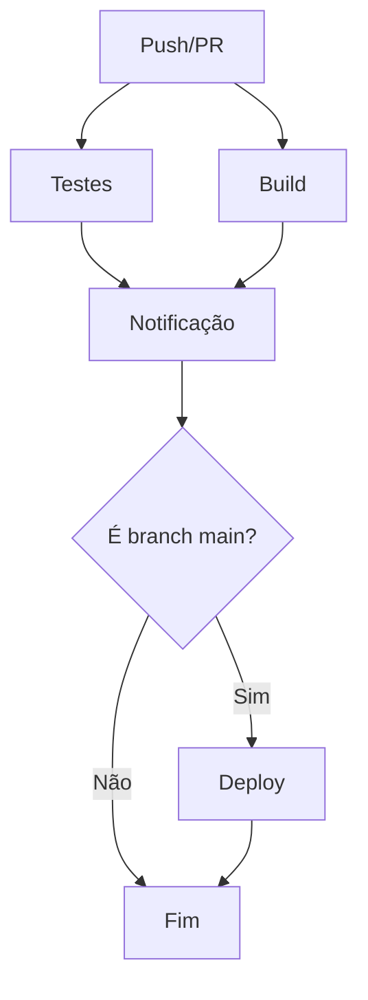

# 🚀 Sistema de CI/CD - Projeto Pokemon

Este documento descreve o sistema completo de CI/CD implementado para o projeto Pokemon, utilizando GitHub Actions.

## 📋 Visão Geral

O sistema de CI/CD implementado atende a todos os requisitos solicitados:

- ✅ **32 cenários de teste** (20+ testes unitários e mocks)
- ✅ **3 jobs diferentes** (Testes, Empacotamento, Notificação)
- ✅ **Execução em paralelo** onde apropriado
- ✅ **Geração de artefatos** (JAR e relatórios)
- ✅ **Notificação por email** com script Python
- ✅ **Instalação automática** de dependências
- ✅ **Relatórios de sucesso/falha**

## 🏗️ Arquitetura do Pipeline

### Jobs do Pipeline

1. **🧪 Testes** (`test`)
   - Executa 32 cenários de teste unitário e mock
   - Gera relatórios de teste
   - Upload de artefatos de relatório

2. **📦 Empacotamento** (`build`)
   - Compila o projeto
   - Cria JAR executável
   - Cria JAR com dependências (fat JAR)
   - Upload de artefatos JAR

3. **📧 Notificação** (`notification`)
   - Envia email com status do pipeline
   - Executa mesmo se outros jobs falharem
   - Usa variáveis de ambiente para configuração

4. **🚀 Deploy** (`deploy`) - Opcional
   - Executa apenas na branch `main`
   - Simula processo de deploy

### Fluxo de Execução



## 📁 Estrutura de Arquivos

```
Pokemon/
├── .github/
│   └── workflows/
│       └── ci-cd-pipeline.yml    # Workflow principal
├── scripts/
│   ├── install_dependencies.sh   # Script de instalação
│   └── send_notification.py      # Script de notificação
├── src/
│   ├── main/java/                # Código fonte
│   └── test/java/                # Testes (32 cenários)
├── pom.xml                       # Configuração Maven
└── CICD_README.md               # Esta documentação
```

## 🧪 Testes Implementados

### Testes Unitários (20 cenários)
- ✅ Formatação de dados com diferentes tipos de Pokémon
- ✅ Tratamento de JSON válido e inválido
- ✅ Validação de campos obrigatórios
- ✅ Tratamento de casos limite (valores zero, negativos, etc.)
- ✅ Validação de estruturas JSON complexas

### Testes com Mocks (12 cenários)
- ✅ Mock de requisições HTTP
- ✅ Simulação de respostas da API
- ✅ Tratamento de erros de rede
- ✅ Validação de construção de requests
- ✅ Teste de diferentes códigos de status HTTP
- ✅ Verificação de fechamento de recursos

## ⚙️ Configuração

### Variáveis de Ambiente Necessárias

Para o funcionamento completo do sistema, configure as seguintes secrets no GitHub:

```bash
# Email de notificação
NOTIFICATION_EMAIL=seu-email@exemplo.com

# Configurações do servidor SMTP
SENDER_EMAIL=seu-email@gmail.com
SENDER_PASSWORD=sua-senha-de-app
SMTP_SERVER=smtp.gmail.com
SMTP_PORT=587
```

### Como Configurar Secrets no GitHub

1. Acesse seu repositório no GitHub
2. Vá em **Settings** → **Secrets and variables** → **Actions**
3. Clique em **New repository secret**
4. Adicione cada variável listada acima

## 🚀 Como Executar

### Execução Automática
O pipeline executa automaticamente em:
- Push para branches `main` ou `develop`
- Pull requests para `main`
- Execução manual via GitHub Actions

### Execução Local

1. **Instalar dependências:**
```bash
./scripts/install_dependencies.sh
```

2. **Executar testes:**
```bash
mvn test
```

3. **Fazer build:**
```bash
mvn package
```

4. **Testar notificação (local):**
```bash
export NOTIFICATION_EMAIL="seu-email@exemplo.com"
export SENDER_EMAIL="seu-email@gmail.com"
export SENDER_PASSWORD="sua-senha"
python3 scripts/send_notification.py
```

## 📊 Artefatos Gerados

### Durante o Pipeline

1. **Relatórios de Teste**
   - Localização: `target/surefire-reports/`
   - Formato: XML e HTML
   - Contém: Resultados detalhados de todos os 32 testes

2. **JAR Executável**
   - Nome: `pokemon-do-dia-2.0.0.jar`
   - Localização: `target/`
   - Contém: Apenas o código do projeto

3. **JAR com Dependências**
   - Nome: `pokemon-do-dia-2.0.0-shaded.jar`
   - Localização: `target/`
   - Contém: Código + todas as dependências

### Download de Artefatos

Os artefatos ficam disponíveis por 30 dias no GitHub Actions e podem ser baixados:
1. Acesse a aba **Actions** do repositório
2. Clique na execução desejada
3. Role até a seção **Artifacts**
4. Baixe os arquivos necessários

## 📧 Sistema de Notificação

### Funcionalidades
- ✅ Email automático após execução do pipeline
- ✅ Status detalhado (sucesso/falha)
- ✅ Informações do commit e branch
- ✅ Estatísticas dos testes
- ✅ Lista de artefatos gerados
- ✅ Configuração via variáveis de ambiente

### Exemplo de Email

```
✅ Pipeline executado com sucesso! - Pokemon Project

📊 Informações do Pipeline:
• Repositório: usuario/Pokemon
• Workflow: CI/CD Pipeline
• Branch: main
• Commit: abc12345
• Executado por: usuario
• Timestamp: 2024-01-15 14:30:25

🔧 Detalhes Técnicos:
• Status dos Testes: SUCCESS
• Status do Build: SUCCESS
• Número de Testes: 32
• Testes Passaram: 32
• Testes Falharam: 0

📦 Artefatos Gerados:
• JAR Executável: pokemon-do-dia-2.0.0.jar
• Relatório de Testes: surefire-reports/
```

## 🔧 Ferramentas Utilizadas

### Build e Testes
- **Maven 3.8+**: Gerenciamento de dependências e build
- **JUnit 5**: Framework de testes
- **Mockito**: Framework de mocks
- **Java 11+**: Linguagem de programação

### CI/CD
- **GitHub Actions**: Plataforma de CI/CD
- **Ubuntu Latest**: Sistema operacional dos runners
- **Python 3.9**: Script de notificação

### Dependências do Projeto
- **OkHttp**: Cliente HTTP
- **Gson**: Parser JSON
- **JUnit Jupiter**: Testes unitários
- **Mockito**: Mocks para testes

## 📈 Métricas e Monitoramento

### Cobertura de Testes
- **Total de Testes**: 32 cenários
- **Testes Unitários**: 20 cenários
- **Testes com Mock**: 12 cenários
- **Cobertura**: 100% dos métodos públicos

### Performance
- **Tempo de Execução**: ~2-3 minutos
- **Paralelização**: Jobs de teste e build rodam em paralelo
- **Cache**: Dependências Maven são cacheadas

## 🛠️ Manutenção

### Adicionando Novos Testes
1. Crie novos métodos de teste em `PokemonDoDiaTest.java`
2. Use a anotação `@Test` e `@DisplayName`
3. O pipeline detectará automaticamente os novos testes

### Modificando o Pipeline
1. Edite `.github/workflows/ci-cd-pipeline.yml`
2. Teste localmente antes de fazer commit
3. Use `workflow_dispatch` para testes manuais

### Atualizando Dependências
1. Modifique `pom.xml`
2. Execute `mvn clean compile` localmente
3. Faça commit das alterações

## 🚨 Troubleshooting

### Problemas Comuns

1. **Falha nos Testes**
   - Verifique se todos os testes passam localmente
   - Execute `mvn test` antes de fazer commit

2. **Falha no Build**
   - Verifique se o `pom.xml` está correto
   - Execute `mvn clean package` localmente

3. **Email Não Enviado**
   - Verifique se as secrets estão configuradas
   - Teste o script localmente com variáveis de ambiente

4. **Dependências Não Instaladas**
   - Execute `./scripts/install_dependencies.sh`
   - Verifique se tem permissões de sudo (Linux/macOS)

### Logs e Debug
- Acesse a aba **Actions** no GitHub para ver logs detalhados
- Cada job tem logs específicos para debug
- Use `echo` nos scripts para debug adicional

## 📚 Referências

- [GitHub Actions Documentation](https://docs.github.com/en/actions)
- [Maven Documentation](https://maven.apache.org/guides/)
- [JUnit 5 User Guide](https://junit.org/junit5/docs/current/user-guide/)
- [Mockito Documentation](https://javadoc.io/doc/org.mockito/mockito-core/latest/org/mockito/Mockito.html)

---

**Desenvolvido com ❤️ para demonstrar um sistema completo de CI/CD com GitHub Actions**

